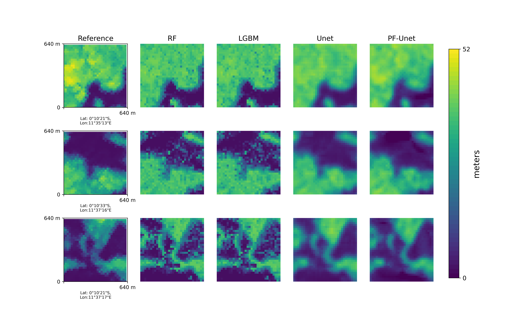
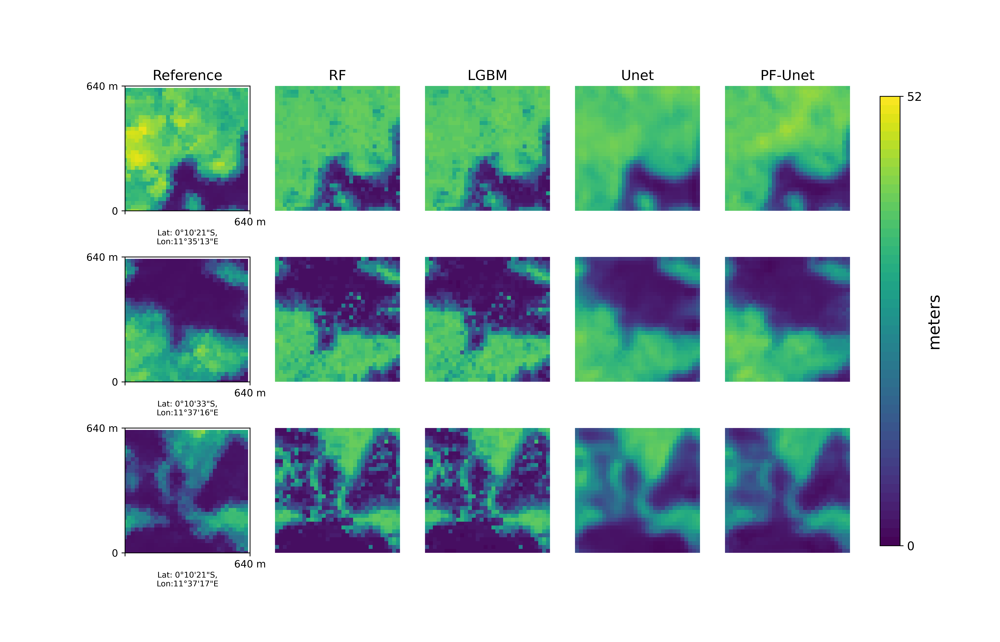
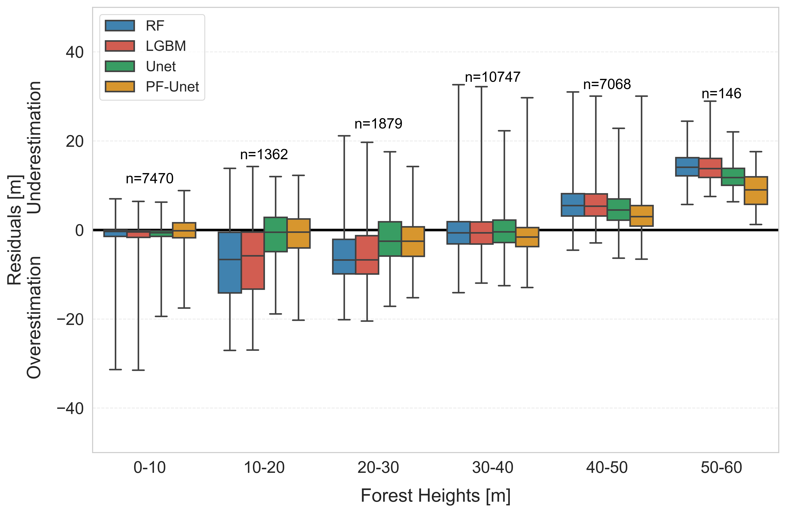
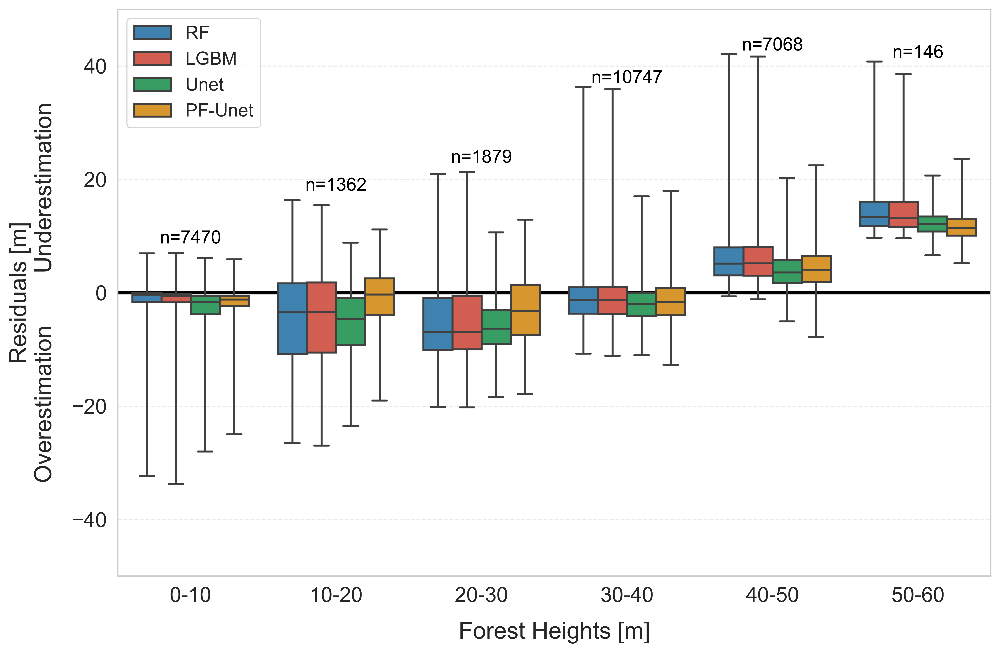

# Deep Learning-Based Vegetation Canopy Height Mapping with Polarimetric SAR

## Project Overview

This project focuses on estimating vegetation canopy height using a deep learning approach with polarimetric Synthetic Aperture Radar (PolSAR) data. A **Polarization Fusion U-Net (PF-Unet)** model is proposed to enhance canopy height estimation from SAR backscatter data by effectively utilizing multi-polarization channels (HH, HV, and VV). The study applies the model to **L- and P-band SAR data collected over Gabon's tropical forests** and compares performance against traditional machine learning approaches and a standard U-Net model.

## Features

- **Deep Learning for Canopy Height Estimation**: Implements a **Polarization Fusion U-Net (PF-Unet)** optimized for SAR data.
- **Multi-Polarization Data Fusion**: Leverages HH, HV, and VV backscatter channels to improve accuracy.
- **Accuracy Assessment**: Evaluates model performance using **RMSE, R², Mean Absolute Error (MAE), and Mean Bias (mBias).**
- **Comparison with Traditional Methods**: Benchmarks against **Random Forest (RF), LightGBM (LGBM), and a standard U-Net model.**
- **Feature Importance Analysis**: Identifies the influence of different SAR polarization channels.
- **Visualization**: Generates prediction maps and residual plots for canopy height estimation.

## Dataset

- **SAR Data**: Full-polarimetric L- and P-band SAR backscatter images from the AfriSAR campaign (ESA & NASA).
- **Reference Data**: Canopy height ground truth from **NASA LVIS LiDAR data**.
- **Study Area**: Lopé National Park, Gabon.

## Project Workflow

1. **SAR Data Preprocessing**: Converts SAR backscatter to **γ0 coefficients** and aligns with reference data.
2. **Feature Extraction**: Utilizes HH, HV, and VV channels as inputs for training.
3. **Model Training & Optimization**:
   - Custom **PF-Unet** model with polarization fusion and attention gates.
   - Hyperparameter tuning for Random Forest and LightGBM.
4. **Accuracy Assessment**:
   - Compute **RMSE, R², MAE, and mBias**.
   - Evaluate model performance across different canopy height strata.
5. **Prediction & Visualization**:
   - Generate **canopy height maps** for the study area.
   - Compare U-Net vs. ML models.

## Results

- **PF-Unet achieved the best accuracy**:
  - **L-band RMSE**: 4.35 m (15.73%) | **P-band RMSE**: 4.43 m (15.95%)
  - **L-band R²**: 0.93 | **P-band R²**: 0.92
  - **Lower bias and improved consistency** across all height strata.
- **PF-Unet outperformed all baseline models**, reducing error and improving robustness.
- **Identified key height strata where P-band tends to overestimate shorter canopy heights.**

## Example Images

### 1. **PF-Unet Architecture**
   *Illustrates the modified U-Net architecture used for canopy height estimation.*
   

### 2. **Estimated Canopy Height Map**
   *Predicted canopy height maps for different SAR bands.*
   
   **L-band Prediction**
   
   
   **P-band Prediction**
   

### 3. **Residual Analysis**
   *Residual error analysis of different models applied to L-band and P-band data.*
   
   **L-band Residual Analysis**
   
   
   **P-band Residual Analysis**
   

## Technologies Used

- **Python**: Primary programming language.
- **Libraries**: `rasterio`, `geopandas`, `numpy`, `pandas`, `matplotlib`, `seaborn`, `scikit-learn`, `tensorflow`.
- **Machine Learning**: Random Forest, LightGBM.
- **Deep Learning**: Custom PF-Unet architecture with attention mechanisms.

## How to Use the Code
This research manuscript is under review hence all of the code will available upon publicaiton. Check the scripts folder for codes

### 1. Clone the Repository

```sh
git clone https://github.com/yourusername/canopy-height-mapping.git
cd canopy-height-mapping
```

## References

- **Hajnsek et al. (2017)**: Technical Assistance for the Development of Airborne SAR and Geophysical Measurements during the AfriSAR Experiment.
- **Quegan et al. (2019)**: The BIOMASS mission – Mapping forest height and biomass from space.
- **Guliaev et al. (2021)**: Forest height estimation using TanDEM-X InSAR and LiDAR data.
